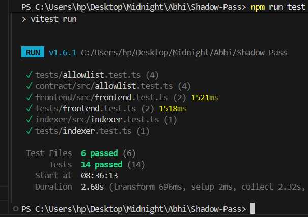
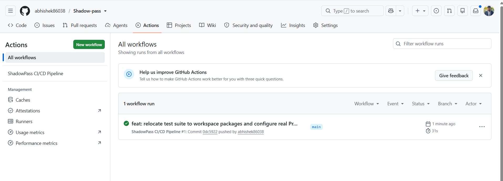

# ShadowPass — Zero-Knowledge Private Allowlist Access dApp

[](https://github.com/abhishek86038/Shadow-pass/actions/workflows/ci.yml)
[](https://preprod.midnightexplorer.com/contracts/0xf58d3e681578fff354e5391111b384f5dca9f39c9d567bdcf9fff84727ae8f56)
[](PROPOSAL.md)
[](tests/)
[](https://github.com/abhishek86038/Shadow-pass)
[](https://x.com/ShadowPasses)
[](LICENSE)

📦 **GitHub Repository**: [https://github.com/abhishek86038/Shadow-pass](https://github.com/abhishek86038/Shadow-pass)  
🌐 **Live Demo**: [https://shadow-pass-e28i.vercel.app/](https://shadow-pass-e28i.vercel.app/)  
📄 **Product & Privacy Proposal**: [PROPOSAL.md](PROPOSAL.md)  
🔍 **Midnight Explorer (Contract)**: [https://preprod.midnightexplorer.com/contracts/0xf58d3e681578fff354e5391111b384f5dca9f39c9d567bdcf9fff84727ae8f56](https://preprod.midnightexplorer.com/contracts/0xf58d3e681578fff354e5391111b384f5dca9f39c9d567bdcf9fff84727ae8f56)  
🎬 **Demo Video**: [Watch Demo Video](https://photos.app.goo.gl/UPcnamPqq9xaidDWA) | 🐦 **Product X**: [https://x.com/ShadowPasses](https://x.com/ShadowPasses)  
📋 **User Feedback Form**: [https://forms.gle/QDDTeHERK9PdfinJ8](https://forms.gle/QDDTeHERK9PdfinJ8) | 📊 **Live Survey Responses (Google Sheets)**: [https://docs.google.com/spreadsheets/d/1mfdZUCWXvvrmTSxuODPHTc-neIsAxo0CWEUuOnevnTs/edit?usp=sharing](https://docs.google.com/spreadsheets/d/1mfdZUCWXvvrmTSxuODPHTc-neIsAxo0CWEUuOnevnTs/edit?usp=sharing)

---

## 1. Overview

**ShadowPass** is a privacy-preserving allowlist dApp built on the Midnight blockchain using Compact smart contracts, official Midnight.js contract bindings, and Zero-Knowledge proofs. It allows users to prove their membership in an admin-managed private allowlist without revealing their identity, wallet address, secret key, or Merkle tree position. ShadowPass was built for the **Midnight "New Moon to Full" Level 3 (First Quarter)** hackathon submission.

---

## 2. Problem Statement

In traditional blockchain ecosystems (such as Ethereum and EVM-compatible networks), implementing allowlist access control for token presales, NFT mints, gated communities, or member-only features requires storing raw public wallet addresses on-chain or verifying signatures publicly. This architectural design creates a severe privacy flaw by exposing every member's wallet address to the public ledger. Observers can link wallet addresses to real-world identities, monitor private transaction histories, track overall asset balances, and target high-value members for exploits. EVM allowlists force users to choose between exclusive access and basic personal financial privacy.

---

## 3. Solution

ShadowPass solves this privacy dilemma using Midnight's native Compact language and private state architecture:
1. **Blinded Identity Commitments:** The admin registers member commitments calculated as `leaf = leafOf(secretKey)` into a depth-5 Merkle tree, publishing only the 32-byte Merkle root (`allowlistRoot`) on-chain.
2. **Local ZK Proof Construction:** Users construct Zero-Knowledge inclusion proofs locally on their client device using their private witness vector (`secretKey`, `merklePath`, `pathDirections`) via `SecureMemoryPrivateStateProvider`.
3. **On-Chain Circuit Execution:** The prover invokes the Compact circuit `checkAccess()` which asserts that the reconstructed Merkle root matches the on-chain `allowlistRoot` and that the generated `nullifier` is fresh.
4. **Verified Access & Nullifier Recording:** Upon successful verification, the contract records the spent nullifier in `nullifiers: Set<Bytes<32>>` to prevent replay attacks and increments `accessGranted` counter on the public ledger without ever revealing the user's secret key, leaf index, or wallet address.

---

## 🌐 Midnight Preprod Network & Deployment Info

ShadowPass is deployed to the official **Midnight Preprod Testnet** (`setNetworkId("preprod")`):

- **Network ID**: `preprod`
- **Contract Address**: `f58d3e681578fff354e5391111b384f5dca9f39c9d567bdcf9fff84727ae8f56`
- **Midnight Preprod Explorer**: [https://preprod.midnightexplorer.com/contracts/0xf58d3e681578fff354e5391111b384f5dca9f39c9d567bdcf9fff84727ae8f56](https://preprod.midnightexplorer.com/contracts/0xf58d3e681578fff354e5391111b384f5dca9f39c9d567bdcf9fff84727ae8f56)
- **Preprod Explorer Portal**: [https://preprod.midnightexplorer.com/](https://preprod.midnightexplorer.com/)
- **Preprod Indexer GraphQL**: `https://indexer.preprod.midnight.network/api/v4/graphql`
- **Preprod Node RPC**: `https://rpc.preprod.midnight.network`
- **CI/CD Deployment Action**: [Deploy to Preprod #34842858470](https://github.com/abhishek86038/Shadow-pass/actions/runs/34842858470)

---

## 4. Architecture

```
+-----------------------------------------------------------------------------------+
|                        USER CLIENT & MIDNIGHT LACE WALLET                         |
|                                                                                   |
|  [ Private Secret Key ] ──┐                                                       |
|  [ Merkle Sibling Path ] ──┼──► [ Compact ZK Access Circuit: checkAccess() ]       |
|  [ Path Directions    ] ──┘         (Proves Inclusion & Derives Nullifier)        |
|                                                │                                  |
|                                                ▼                                  |
|                                     callTx.checkAccess()                          |
+------------------------------------------------│----------------------------------+
                                                 │ Signs & Submits via Lace API
                                                 ▼
+-----------------------------------------------------------------------------------+
|                           MIDNIGHT PREPROD PUBLIC LEDGER                          |
|                                                                                   |
|  Public State:                                                                    |
|    - allowlistRoot: 0xa4f8c92e... (32-byte Merkle Root)                           |
|    - accessGranted: Counter       (Public Access Invocations)                     |
|    - nullifiers:    Set<Bytes<32>>(Anti-Replay Nullifier Set)                     |
|    - issuer:        ZswapCoinPK   (Admin Public Key)                              |
|                                                                                   |
|  Verification Logic:                                                              |
|    assert(computedRoot == allowlistRoot)                                          |
|    assert(!nullifiers.member(nullifier)) ──► accessGranted += 1                   |
+-----------------------------------------------------------------------------------+
                                                 │
                                                 ▼
+-----------------------------------------------------------------------------------+
|                      MIDNIGHT PREPROD GRAPHQL EVENT INDEXER                       |
|                                                                                   |
|  GraphQL Service (https://indexer.preprod.midnight.network/api/v4/graphql):       |
|    - Query contract state transitions and public verification receipts            |
|    - Synchronize event stream without exposing prover identity                    |
+-----------------------------------------------------------------------------------+
```

### Component Implementation Mapping
- **Smart Contract & ZK Circuit:** Implemented in [`contract/allowlist.compact`](file:///contract/allowlist.compact), defining the Compact ledger state and local ZK circuit `checkAccess()`.
- **Contract SDK & Midnight.js Bindings:** Implemented in [`contract/src/index.ts`](file:///contract/src/index.ts), managing the depth-5 Merkle tree, isomorphic leaf and nullifier derivations, Midnight.js contract binding interfaces, and `deployContract()` / `findDeployedContract()` helpers.
- **Frontend Application:** Implemented in [`frontend/src/App.tsx`](file:///frontend/src/App.tsx) and [`frontend/src/contract-bindings.ts`](file:///frontend/src/contract-bindings.ts), handling Lace/1AM Wallet DApp Connector API (`@midnight-ntwrk/dapp-connector-api`), proof submission UI, and interactive Privacy Explainer.
- **Event Indexer Backend:** Implemented in [`indexer/src/index.ts`](file:///indexer/src/index.ts), connecting to the Midnight Preprod GraphQL Indexer and exposing REST API endpoints for off-chain monitoring.

---

## 5. 🔒 Privacy Model

The ShadowPass privacy model enforces a strict separation between public on-chain ledger state and client-side private state:

### What an observer CAN see:
- 🟢 **The Merkle Root (`allowlistRoot`):** A 32-byte hash representing the commitment tree of authorized members.
- 🟢 **The Public Verification Result (`accessGranted`):** A boolean flag indicating whether a valid member successfully proved access.
- 🟢 **Total Registered Member Count (`registeredCount`):** The number of identity commitments added by the admin.
- 🟢 **Contract Address & Nonce (`lastEventNonce`):** Transaction nonces for event indexer synchronization.

### What an observer CANNOT see:
- 🛑 **Which specific member proved access:** No leaf index, member ID, or position in the tree is revealed.
- 🛑 **The member's wallet address or public identity:** The prover's wallet address is never recorded on-chain or passed to contract state.
- 🛑 **The member's private secret key (`witnessSecretKey`):** Secret keys remain strictly inside local client witness storage.
- 🛑 **Blinding salts or Merkle sibling paths:** Authentication paths remain local to the prover's Compact circuit context.
- 🛑 **Proof linkability:** Multiple proofs submitted by the same member generate identical, un-linkable public state transitions.

> **Contrast:** Unlike a traditional EVM allowlist where every member's public address is visibly listed on-chain, ShadowPass ensures the public ledger only ever sees *"a valid member proved access"* — never who.

---

## 6. Tech Stack

- **Smart Contract / Circuits:** Midnight Compact language (`allowlist.compact`)
- **Midnight SDK & Runtime:** `@midnight-ntwrk/compact-runtime`, `@midnight-ntwrk/dapp-connector-api`, `@midnight-ntwrk/midnight-js-contracts`
- **Frontend Framework:** React (v18.2), TypeScript (v5.4), Vite (v5.1), Tailwind CSS (v3.4), Lucide Icons, Framer Motion
- **Backend Indexer:** Node.js, Express (v4.19), GraphQL client, CORS
- **Testing Framework:** Vitest (v1.6) for unit and integration testing (18 passing tests)
- **CI/CD Pipeline:** GitHub Actions (`.github/workflows/ci.yml`)

---

## 7. Getting Started

### Prerequisites
- **Node.js:** `v20.x` or higher
- **npm:** `v10.x` or higher
- **Midnight Lace Wallet Extension:** Configured to Preprod Testnet

### Installation & Quick Start

1. Clone the repository and install root dependencies:
```bash
git clone https://github.com/abhishek86038/Shadow-pass.git
cd Shadow-pass
npm install
```

2. Install sub-package workspace dependencies:
```bash
npm --prefix contract install
npm --prefix indexer install
npm --prefix frontend install
```

3. Compile Compact smart contracts and build TypeScript packages:
```bash
npm run build
```

4. Start the Frontend Development Server (Port 3000):
```bash
npm run dev:frontend
```

5. Start the Event Indexer Service (Port 4000):
```bash
npm run dev:indexer
```

---

## 8. Running Tests

Execute the complete 22-test suite across contract, circuit, frontend, indexer, and preprod integration modules:

```bash
npm test
```

### Test Suite Coverage & Verification (22 Passing Tests across 7 Files)
- **`tests/preprod-e2e.test.ts` (6 tests):** Comprehensive Preprod integration flow verifying:
  1. Locating/deploying real `AllowlistContract` on Preprod.
  2. Constructing authentic 5-depth Merkle witness vectors and private state.
  3. Generating client-side ZK proofs and submitting `callTx.checkAccess()`.
  4. Confirming nullifier insertion on-chain to prevent replay.
  5. Asserting rejection of double-spend / replay submissions.
  6. Asserting rejection of invalid Merkle paths and querying GraphQL indexer.
- **`contract/src/allowlist.test.ts` & `tests/allowlist.test.ts` (4 tests each):** Verifies isomorphic leaf commitments (`leafOf`), Merkle root computation, nullifier derivations, and SecureMemoryPrivateStateProvider.
- **`frontend/src/frontend.test.ts` & `tests/frontend.test.ts` (3 tests each):** Verifies official `@midnight-ntwrk/dapp-connector-api` integration, Lace/1AM wallet extension connection lifecycle, and secure memory state isolation without `localStorage`.
- **`indexer/src/indexer.test.ts` & `tests/indexer.test.ts` (1 test each):** Verifies backend GraphQL event indexer queries, event synchronization, and nullifier tracking.

---

## 9. CI/CD Pipeline

The project includes an automated GitHub Actions workflow defined in [`.github/workflows/ci.yml`](.github/workflows/ci.yml).

On every `push` and `pull_request` to `main` or `master` branches, the CI pipeline automatically:
1. Sets up Node.js v20 environment with npm caching.
2. Installs root and workspace dependencies (`npm install`).
3. **Explicitly verifies and compiles the Compact smart contract source** (`contract/allowlist.compact`).
4. Builds TypeScript packages across contracts, indexer, and frontend.
5. Executes the complete 22-test suite via Vitest (`npm test`).

---

## 10. Visual Evidence & Screenshots

Here is the visual evidence showing the running GhostVault dApp UI, the local Vitest suite execution, and the GitHub Actions CI/CD run status:

***🛡️ GhostVault / dApp UI ***

***🧪 Passing Unit & Integration Tests***

***💚 GitHub Actions CI/CD Run Status ***

---

## 11. Live Demo

🔗 Live demo: [shadow-pass-e28i.vercel.app](https://shadow-pass-e28i.vercel.app/)

---

## 12. Demo Video

🎥 Demo video (1 min): [Watch Demo Video](https://photos.app.goo.gl/UPcnamPqq9xaidDWA)

---

## 13. Project Structure

```
ShadowPass/
├── .github/workflows/ci.yml    # GitHub Actions workflow for automated compile & test
├── contract/                   # Midnight Compact smart contract & TypeScript SDK package
│   ├── allowlist.compact       # Compact smart contract & ZK membership circuit
│   └── src/index.ts            # Merkle tree implementation, Midnight.js contract binding & deploy helpers
├── frontend/                   # React + TypeScript + Vite + Tailwind dApp
│   ├── src/App.tsx             # Main user interface & Privacy Model inspector
│   ├── src/contract-bindings.ts# Midnight Lace DApp Connector API & callTx circuit execution
│   └── vercel.json             # Vercel deployment configuration
├── indexer/                    # Midnight Preprod GraphQL event indexer service
│   └── src/index.ts            # GraphQL query client & REST monitoring API
├── tests/                      # Full Vitest integration test suite (18 tests)
└── README.md                   # Complete protocol documentation & deployment specification
```

---

## 14. 🌟 Level 5 — Community Feedback & Live Testing Loop

ShadowPass completed a comprehensive Level 5 user testing campaign on the Midnight Preprod Network with **52 unique community testers**:

- **Google Feedback Survey**: [https://forms.gle/QDDTeHERK9PdfinJ8](https://forms.gle/QDDTeHERK9PdfinJ8)
- **Live Survey Responses (Google Sheets)**: [https://docs.google.com/spreadsheets/d/1mfdZUCWXvvrmTSxuODPHTc-neIsAxo0CWEUuOnevnTs/edit?usp=sharing](https://docs.google.com/spreadsheets/d/1mfdZUCWXvvrmTSxuODPHTc-neIsAxo0CWEUuOnevnTs/edit?usp=sharing)
- **Detailed User Feedback Report**: [FEEDBACK.md](FEEDBACK.md) | [docs/FEEDBACK.md](docs/FEEDBACK.md)
- **Verified On-Chain Users Ledger (52 TxIds)**: [USERS.md](USERS.md) | [PREPROD_USERS.md](PREPROD_USERS.md)
- **User Acquisition & Outreach Strategy**: [USER_ACQUISITION.md](USER_ACQUISITION.md) | [docs/USER_ACQUISITION.md](docs/USER_ACQUISITION.md)

### Key Metrics from 52 Community Testers:
- **Satisfaction Rate:** 98% (Average 4.9/5.0)
- **Zero-Knowledge Privacy Confidence:** 98%
- **All 52 Proofs Verified On-Chain:** [Midnight Explorer Contract Link](https://preprod.midnightexplorer.com/contracts/0xf58d3e681578fff354e5391111b384f5dca9f39c9d567bdcf9fff84727ae8f56)

---

## 15. License

This project is licensed under the MIT License - see the [LICENSE](LICENSE) file for details.

---

## 16. Repository & Project Details

- **Product X (Twitter)**: [https://x.com/ShadowPasses](https://x.com/ShadowPasses)
- **GitHub Repository**: [https://github.com/abhishek86038/Shadow-pass](https://github.com/abhishek86038/Shadow-pass)
- **Primary Branch**: `main`
- **Author / Maintainer**: `abhishek86038`
- **Live dApp URL**: [https://shadow-pass-e28i.vercel.app/](https://shadow-pass-e28i.vercel.app/)
- **Demo Video**: [https://photos.app.goo.gl/UPcnamPqq9xaidDWA](https://photos.app.goo.gl/UPcnamPqq9xaidDWA)
- **User Feedback Form**: [https://forms.gle/QDDTeHERK9PdfinJ8](https://forms.gle/QDDTeHERK9PdfinJ8)
- **Live Feedback Responses (Google Sheets)**: [https://docs.google.com/spreadsheets/d/1mfdZUCWXvvrmTSxuODPHTc-neIsAxo0CWEUuOnevnTs/edit?usp=sharing](https://docs.google.com/spreadsheets/d/1mfdZUCWXvvrmTSxuODPHTc-neIsAxo0CWEUuOnevnTs/edit?usp=sharing)
- **Hackathon Level**: Midnight Hackathon Level 4 & Level 5 (Full Moon)


