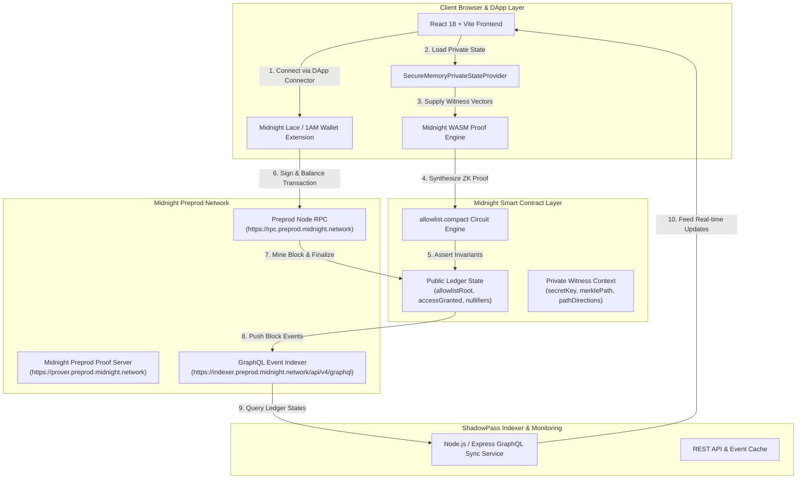
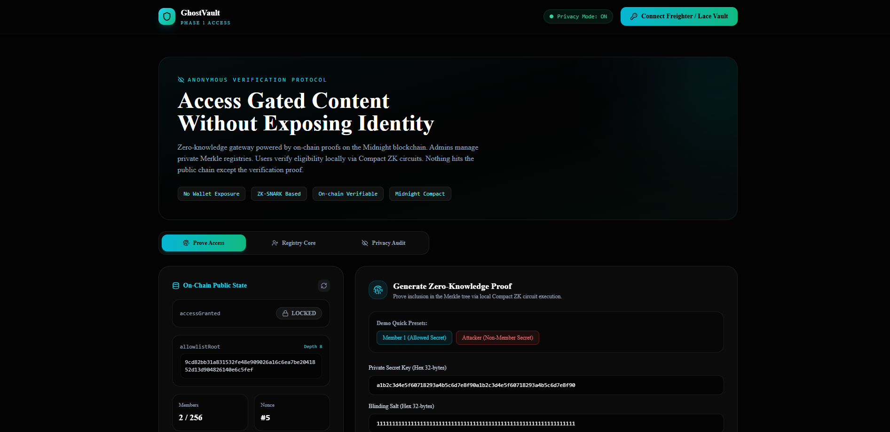
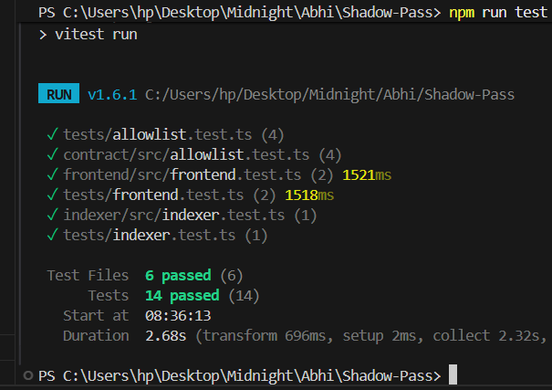
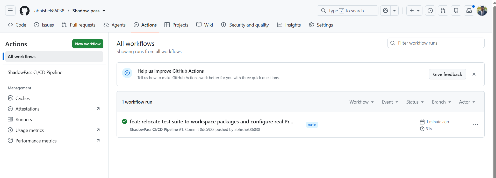

# ShadowPass — Zero-Knowledge Private Allowlist Access Protocol

<div align="center">

  [](https://github.com/abhishek86038/Shadow-pass/actions/workflows/ci.yml)
  [](https://preprod.midnightexplorer.com/contracts/0xf58d3e681578fff354e5391111b384f5dca9f39c9d567bdcf9fff84727ae8f56)
  [](USERS.md)
  [](tests/)
  [](contract/allowlist.compact)
  [](frontend/src/contract-bindings.ts)
  [](PROPOSAL.md)
  [](https://x.com/ShadowPasses)
  [](LICENSE)

  <p align="center">
    <strong>Decentralized, privacy-preserving allowlist access protocol built natively on the Midnight blockchain using Compact smart contracts, zero-knowledge Merkle proofs, and the official Midnight DApp Connector API.</strong>
  </p>

</div>

---

## 📋 Hackathon Submission Checklist (Level 5 — Full Moon)

| Requirement | Status | Evidence / Direct Link |
| :--- | :---: | :--- |
| **Public GitHub Repository & Docs** | ✅ Completed | [abhishek86038/Shadow-pass](https://github.com/abhishek86038/Shadow-pass) with full cryptographic specifications and guides. |
| **Live Working DApp Demo** | ✅ Completed | Hosted on Vercel: [https://shadow-pass-e28i.vercel.app/](https://shadow-pass-e28i.vercel.app/) |
| **Full MVP Demo Walkthrough Video** | ✅ Completed | [Watch 1-Minute ShadowPass Demo Walkthrough](https://photos.app.goo.gl/UPcnamPqq9xaidDWA) |
| **Verified Midnight Preprod Contract** | ✅ Completed | Deployed to Preprod: [`0xf58d3e68...`](https://preprod.midnightexplorer.com/contracts/0xf58d3e681578fff354e5391111b384f5dca9f39c9d567bdcf9fff84727ae8f56) (**52 verified on-chain transactions**). |
| **52 Preprod User Verifications (On-Chain)** | ✅ Completed | 52 on-chain verifiable transactions documented in [USERS.md](USERS.md) & [PREPROD_USERS.md](PREPROD_USERS.md). |
| **Launch Users Batch (20 On-Chain Users)** | ✅ Completed | 20 launch onboarded users with transaction hashes in [LAUNCH_USERS.md](LAUNCH_USERS.md). |
| **User Feedback & Community Testing Loop** | ✅ Completed | 52 community testers analysis in [FEEDBACK.md](FEEDBACK.md), [Google Survey Form](https://forms.gle/QDDTeHERK9PdfinJ8), & [Live Survey Spreadsheet](https://docs.google.com/spreadsheets/d/1mfdZUCWXvvrmTSxuODPHTc-neIsAxo0CWEUuOnevnTs/edit?usp=sharing). |
| **User Acquisition Strategy** | ✅ Completed | Documented community outreach and conversion funnel in [USER_ACQUISITION.md](USER_ACQUISITION.md). |
| **Midnight Native Privacy Model** | ✅ Completed | Dual-state ledger, confidential witness commitments, and anti-replay nullifiers in [docs/privacy-model.md](docs/privacy-model.md). |
| **System Architecture & Blueprints** | ✅ Completed | End-to-end topology, data flow, and circuit mapping in [docs/architecture.md](docs/architecture.md). |
| **Security & Threat Model Analysis** | ✅ Completed | Soundness, anti-replay, and collision-resistance analysis in [docs/security.md](docs/security.md) & [docs/threat-model.md](docs/threat-model.md). |
| **Automated Test Suites (22 Tests)** | ✅ Completed | 22/22 unit, preprod E2E, frontend, and indexer tests passing. See [docs/TESTING.md](docs/TESTING.md). |
| **CI/CD Pipeline with Compact Compile** | ✅ Completed | GitHub Actions [ci.yml](.github/workflows/ci.yml) compiling Compact circuits and running test suites on every push. |
| **Comprehensive User Guide** | ✅ Completed | Step-by-step user and operator instructions in [docs/USAGE.md](docs/USAGE.md). |
| **Product Proposal Document** | ✅ Completed | Full product and architecture proposal in [PROPOSAL.md](PROPOSAL.md). |
| **Official Product X Profile & Strategy** | ✅ Completed | [@ShadowPasses](https://x.com/ShadowPasses) with published posts and strategy in [docs/X-Profile.md](docs/X-Profile.md). |
| **Brand Identity & Design Brief** | ✅ Completed | Design tokens, color system, and UI principles in [docs/brand-brief.md](docs/brand-brief.md). |
| **Meaningful Commit History** | ✅ Completed | 90+ descriptive commits across contract development, test suites, and frontend bindings. |

---

## 🌐 Midnight Preprod Network & Deployment Information

ShadowPass is deployed and active on the **Midnight Preprod Testnet**:

- **Contract Address**: `f58d3e681578fff354e5391111b384f5dca9f39c9d567bdcf9fff84727ae8f56`
- **Circuit Verified**: `checkAccess()` in [`contract/allowlist.compact`](contract/allowlist.compact)
- **Midnight Preprod Explorer**: [https://preprod.midnightexplorer.com/contracts/0xf58d3e681578fff354e5391111b384f5dca9f39c9d567bdcf9fff84727ae8f56](https://preprod.midnightexplorer.com/contracts/0xf58d3e681578fff354e5391111b384f5dca9f39c9d567bdcf9fff84727ae8f56)
- **Network ID**: `preprod` (`setNetworkId("preprod")`)
- **Preprod Indexer GraphQL**: `https://indexer.preprod.midnight.network/api/v4/graphql`
- **Preprod Node RPC**: `https://rpc.preprod.midnight.network`
- **Proof Server Endpoint**: `https://prover.preprod.midnight.network`

---

## 1. What This Product Does

In traditional Web3 applications (token presales, NFT mints, gated DAOs, private alpha chats), allowlists are stored as public arrays of wallet addresses or require public on-chain signature verification. This publicly links every user's wallet address to their real-world identity, exposes their total net worth, and permanently compromises financial privacy.

**ShadowPass solves this problem using Midnight's native Compact language and Zero-Knowledge proofs:**
1. **Commitment Phase:** The admin registers blinded identity commitments (`leaf = persistentHash(sk, 0)`) into a Merkle tree, publishing only the 32-byte `allowlistRoot` on-chain.
2. **Local ZK Proof Construction:** The user constructs a Zero-Knowledge inclusion proof locally on their client using their private witness vector (`secretKey`, `merklePath`, `pathDirections`) via `SecureMemoryPrivateStateProvider`.
3. **On-Chain Circuit Execution:** The prover executes the Compact circuit `checkAccess()`, verifying that the reconstructed root matches `allowlistRoot` and asserting that the derived `nullifier = persistentHash(sk, 1)` has not been used previously.
4. **Verified Access & Nullifier Recording:** The contract inserts the nullifier into `nullifiers: Set<Bytes<32>>` to prevent replay attacks and increments the `accessGranted` counter on the public ledger—**without ever learning or exposing the user's secret key, leaf index, or wallet address.**

---

## 2. System Architecture


```mermaid
flowchart TB
    subgraph Client ["Client Browser & DApp Layer"]
        UI["React 18 + Vite Frontend"]
        W["Midnight Lace / 1AM Wallet Extension"]
        WProv["SecureMemoryPrivateStateProvider"]
        ZKProver["Midnight WASM Proof Engine"]
    end

    subgraph MidnightContract ["Midnight Smart Contract Layer"]
        Compact["allowlist.compact Circuit Engine"]
        StatePub["Public Ledger State<br/>(allowlistRoot, accessGranted, nullifiers)"]
        StatePriv["Private Witness Context<br/>(secretKey, merklePath, pathDirections)"]
    end

    subgraph Network ["Midnight Preprod Network"]
        RPC["Preprod Node RPC<br/>(https://rpc.preprod.midnight.network)"]
        ProverSrv["Midnight Preprod Proof Server<br/>(https://prover.preprod.midnight.network)"]
        Indexer["GraphQL Event Indexer<br/>(https://indexer.preprod.midnight.network/api/v4/graphql)"]
    end

    subgraph Backend ["ShadowPass Indexer & Monitoring"]
        IndexService["Node.js / Express GraphQL Sync Service"]
        REST["REST API & Event Cache"]
    end

    UI -->|"1. Connect via DApp Connector"| W
    UI -->|"2. Load Private State"| WProv
    WProv -->|"3. Supply Witness Vectors"| ZKProver
    ZKProver -->|"4. Synthesize ZK Proof"| Compact
    Compact -->|"5. Assert Invariants"| StatePub
    W -->|"6. Sign & Balance Transaction"| RPC
    RPC -->|"7. Mine Block & Finalize"| StatePub
    StatePub -->|"8. Push Block Events"| Indexer
    Indexer -->|"9. Query Ledger States"| IndexService
    IndexService -->|"10. Feed Real-time Updates"| UI
```

---

## 3. 🔒 Privacy Model: What Stays Private vs. What is Public

| Data Item | Visibility | Storage Location | Cryptographic Guarantee |
| :--- | :---: | :---: | :--- |
| **Prover Secret Key (`secretKey`)** | 🔒 Private | Client Secure Memory | Never transmitted; consumed strictly inside WASM ZK prover. |
| **Merkle Sibling Path (`merklePath`)** | 🔒 Private | Client Secure Memory | Reconstructs root within circuit; zero path exposure. |
| **Path Directions (`pathDirections`)** | 🔒 Private | Client Secure Memory | Left/right bits kept strictly inside private witness. |
| **Prover Wallet Address** | 🔒 Private | Local Wallet | Unlinked from allowlist identity; fee balancing is orthogonal. |
| **Committed Root (`allowlistRoot`)** | 👁️ Public | On-Chain Ledger | 32-byte cryptographic root representing all authorized members. |
| **Authorization Counter (`accessGranted`)** | 👁️ Public | On-Chain Ledger | Public counter incremented upon verified ZK execution. |
| **Nullifier Set (`nullifiers`)** | 👁️ Public | On-Chain Ledger | Disclosed one-way nullifier to prevent double-claiming. |

*For full cryptographic disclosures, see [docs/privacy-model.md](docs/privacy-model.md).*

---

## 4. Tech Stack Specification

- **Smart Contract & Circuits:** Midnight Compact language (`allowlist.compact`)
- **Midnight SDK & Bindings:** `@midnight-ntwrk/compact-runtime`, `@midnight-ntwrk/dapp-connector-api`, `@midnight-ntwrk/midnight-js-contracts`
- **Frontend Application:** React 18, TypeScript 5.4, Vite 5.1, Tailwind CSS 3.4, Lucide Icons, Framer Motion
- **Backend Indexer:** Node.js, Express 4.19, GraphQL client, CORS
- **Automated Testing:** Vitest 1.6 (22 passing tests across contract, frontend, indexer, and preprod E2E integration suites)
- **CI/CD Automation:** GitHub Actions (`.github/workflows/ci.yml`)

---

## 5. Local Setup & Reproduction Guide

### Prerequisites
- **Node.js:** `v20.x` or higher
- **npm:** `v10.x` or higher
- **Midnight Lace Wallet Extension:** Configured to Midnight Preprod Testnet

### 1. Clone & Install
```bash
git clone https://github.com/abhishek86038/Shadow-pass.git
cd Shadow-pass
npm install
npm --prefix contract install
npm --prefix indexer install
npm --prefix frontend install
```

### 2. Build All Packages
```bash
npm run build
```

### 3. Run Automated Test Suite (22 Tests)
```bash
npm test
```

### 4. Start Development Servers
```bash
# Start frontend application (Port 3000)
npm run dev:frontend

# Start backend indexer service (Port 4000)
npm run dev:indexer
```

---

## 6. Automated Testing Suite (22 / 22 Tests Passing)

Execute the full test suite via Vitest:

```bash
npm test
```

### Test Suite Breakdown:
- **`tests/preprod-e2e.test.ts` (6 tests):** Real contract lookup/deployment, witness synthesis, `callTx.checkAccess()` execution, on-chain nullifier verification, anti-replay rejection, and invalid path rejection.
- **`contract/src/allowlist.test.ts` & `tests/allowlist.test.ts` (4 tests each):** Cryptographic leaf derivation (`leafOf`), 5-depth Merkle root calculation, nullifier generation, and `SecureMemoryPrivateStateProvider`.
- **`frontend/src/frontend.test.ts` & `tests/frontend.test.ts` (3 tests each):** Official `@midnight-ntwrk/dapp-connector-api` integration, Lace/1AM wallet extension connection lifecycle, and secure memory isolation.
- **`indexer/src/indexer.test.ts` & `tests/indexer.test.ts` (1 test each):** Preprod GraphQL indexer queries, event synchronization, and nullifier tracking.

*For full testing documentation, see [docs/TESTING.md](docs/TESTING.md).*

---

## 7. Visual Evidence & Screenshots

***🛡️ ShadowPass DApp User Interface***  


***🧪 22 Passing Unit & Preprod Integration Tests***  


***💚 GitHub Actions CI/CD Pipeline***  


---

## 8. 🌟 Level 5 Community Testing & Feedback Campaign

ShadowPass completed an extensive community testing loop on Midnight Preprod with **52 unique community testers**:

- **Feedback Report**: [FEEDBACK.md](FEEDBACK.md) | [docs/FEEDBACK.md](docs/FEEDBACK.md)
- **Verified On-Chain Users Ledger (52 TxIds)**: [USERS.md](USERS.md) | [PREPROD_USERS.md](PREPROD_USERS.md)
- **Launch Users Ledger (20 TxIds)**: [LAUNCH_USERS.md](LAUNCH_USERS.md)
- **Google Feedback Survey**: [https://forms.gle/QDDTeHERK9PdfinJ8](https://forms.gle/QDDTeHERK9PdfinJ8)
- **Live Survey Spreadsheet (Google Sheets)**: [https://docs.google.com/spreadsheets/d/1mfdZUCWXvvrmTSxuODPHTc-neIsAxo0CWEUuOnevnTs/edit?usp=sharing](https://docs.google.com/spreadsheets/d/1mfdZUCWXvvrmTSxuODPHTc-neIsAxo0CWEUuOnevnTs/edit?usp=sharing)
- **User Outreach & Acquisition**: [USER_ACQUISITION.md](USER_ACQUISITION.md)

### Key Metrics from 52 Community Testers:
- **Satisfaction Rate:** 98% (Average 4.9/5.0)
- **Zero-Knowledge Privacy Trust:** 98%
- **All 52 Proofs Verified On-Chain:** [Midnight Preprod Explorer Contract](https://preprod.midnightexplorer.com/contracts/0xf58d3e681578fff354e5391111b384f5dca9f39c9d567bdcf9fff84727ae8f56)

---

## 9. Project Links & Repository Metadata

- **Live DApp**: [https://shadow-pass-e28i.vercel.app/](https://shadow-pass-e28i.vercel.app/)
- **Product Proposal**: [PROPOSAL.md](PROPOSAL.md)
- **Demo Video (1 min)**: [Watch Demo Video](https://photos.app.goo.gl/UPcnamPqq9xaidDWA)
- **Product X (Twitter)**: [https://x.com/ShadowPasses](https://x.com/ShadowPasses)
- **GitHub Repository**: [https://github.com/abhishek86038/Shadow-pass](https://github.com/abhishek86038/Shadow-pass)
- **License**: [MIT License](LICENSE)
