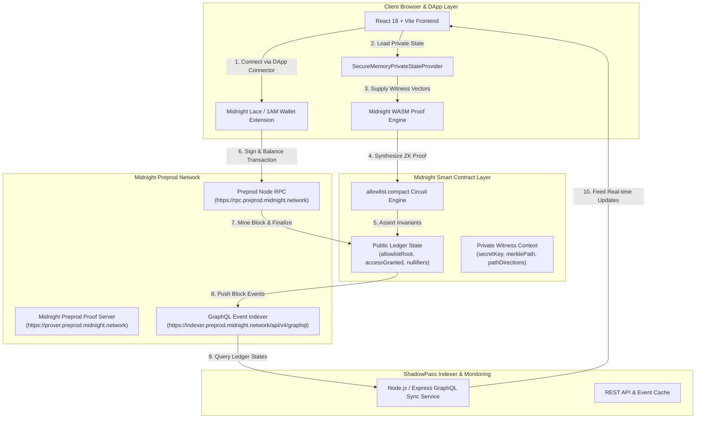

# ShadowPass — System Architecture & Component Blueprints

## 1. System Topology Overview

ShadowPass is engineered as a full-stack, privacy-preserving decentralised application consisting of four tightly integrated layers:

---

## 2. Component Specifications

### 2.1 Compact Smart Contract (`contract/allowlist.compact`)
- **Ledger State:**
  - `allowlistRoot: Bytes<32>` — Committed root hash.
  - `accessGranted: Counter` — Public verification counter.
  - `nullifiers: Set<Bytes<32>>` — Anti-replay spent nullifier set.
  - `issuer: ZswapCoinPublicKey` — Admin coin public key.
- **Circuit Function:** `checkAccess()`
  - Reconstructs Merkle root from private witness inputs.
  - Asserts calculated root equals `allowlistRoot`.
  - Asserts freshness of nullifier.
  - Atomically records nullifier and increments counter.

### 2.2 Contract SDK & Bindings (`contract/src/index.ts`)
- TypeScript wrapper providing high-level type-safe APIs:
  - `findDeployedContract()` — Connects to an existing contract instance on Preprod.
  - `deployContract()` — Deploys a new `AllowlistContract` with an initialized Merkle root.
  - `SecureMemoryPrivateStateProvider` — Secure, memory-isolated witness state manager.
  - `computeMerkleRootFrom()`, `computeLeafCommitment()`, `computeNullifier()` — Isomorphic implementations of Compact cryptographic primitives.

### 2.3 Frontend Application (`frontend/src/`)
- Built with React 18, Vite, and Tailwind CSS.
- Integrates the official `@midnight-ntwrk/dapp-connector-api`.
- Interactive **Privacy Explainer** and **Zero-Knowledge Proof Progress Indicator**.
- Error-resilient transaction execution without simulated fake outcomes.

### 2.4 Indexer & Monitoring Service (`indexer/src/index.ts`)
- Continuously queries Midnight Preprod GraphQL endpoints (`/api/v4/graphql`).
- Synchronizes `allowlistRoot`, `accessGranted`, and `nullifiers` on-chain states.
- Exposes clean JSON REST endpoints for dApp integration and analytical monitoring.
